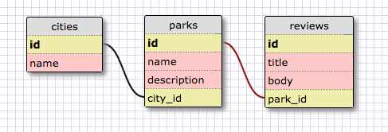

# parkr-anon

An application for users to leave anonymous reviews for parks, by city.

## Schema

## Premises

* User should be able to see all cities

  * Indicates necessity of paths:
    * GET `/cities`

* User should be able to see all parks listings within a city

  * Indicates necessity of paths:
    * GET `/cities/:city_id/parks`

* User should be able to create a park listing within a city

  * Indicates necessity of paths:
    * GET `/cities/:city_id/parks/new`
    * POST `/cities/:city_id/parks`

* User should be able to view a park listing and all its corresponding reviews

  * Indicate necessity of paths:
    * GET `/cities/:city_id/parks/:id`

* User should be able to edit (but not delete) a park listing

  * Indicate necessity of paths:
    * GET `/cities/:city_id/parks/:id/edit`
    * PUT `/cities/:city_id/parks/:id/`

* User should be able to write, edit, and delete a review for a park listing

  * Indicate necessity of paths:
    * GET `/cities/:city_id/parks/:park_id/reviews/new`
    * POST `/cities/:city_id/parks/:park_id/reviews`
    * PUT `/cities/:city_id/parks/:park_id/reviews/:id`
    * DELETE `/cities/:city_id/parks/:park_id/reviews/:id`
